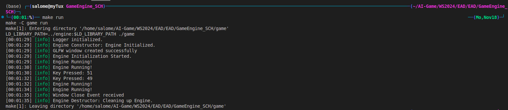
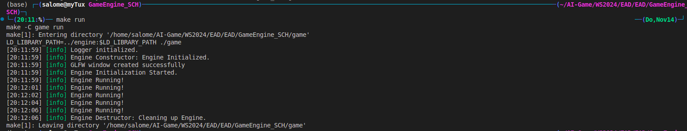
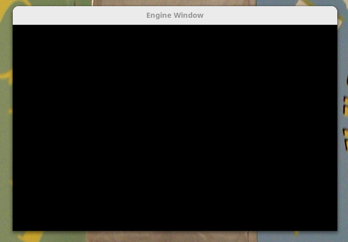

## How to build
### from Root (GameEngine_SCH)
    - make (to build both engine and game)
    - make run (to run the game)
    - make clean (optionally)

## Output 
### (0V3) after adding an Event System


### (0V2) after adding a Window System




### (0V1) after adding a Logging System


### (0V0) after Engine Setup


## Basic Folder Structure
### (0V2 + 0V3)
```plaintext

├── GameEngine_SCH
│   ├── assets
│   │   └── Output*.png
│   ├── engine
│   │   ├── Engine.d
│   │   ├── EventSystem.d
│   │   ├── libEngine.so
│   │   ├── Logger.d
│   │   ├── Makefile
│   │   ├── obj
│   │   │   ├── Engine.o
│   │   │   ├── EventSystem.o
│   │   │   ├── Logger.o
│   │   │   └── Window.o
│   │   ├── private_include
│   │   │   └── Window.h
│   │   ├── src
│   │   │   ├── Engine.cpp
│   │   │   ├── EventSystem.cpp
│   │   │   ├── Logger.cpp
│   │   │   └── Window.cpp
│   │   └── Window.d
│   ├── game
│   │   ├── game
│   │   ├── main.d
│   │   ├── Makefile
│   │   ├── obj
│   │   │   └── main.o
│   │   ├── private_include
│   │   └── src
│   │       ├── main.cpp
│   │       └── main.d
│   ├── include
│   │   ├── Engine.h
│   │   ├── Event.h
│   │   ├── EventSystem.h
│   │   └── Logger.h
│   ├── Makefile
│   └── README.md
└── README.md

```

### (0V1)
```plaintext
├── GameEngine_SCH
│   ├── engine
│   │   ├── libEngine.so
│   │   ├── Makefile
│   │   ├── private_include
│   │   └── src
│   │       └── Engine.cpp
│   │       └── Logger.cpp
│   ├── game
│   │   ├── game
│   │   ├── Makefile
│   │   ├── private_include
│   │   └── src
│   │       ├── main.cpp
│   ├── include
│   │   └── Engine.h
│   │   └── Logger.h
│   ├── Makefile
│   ├── README.md
|   ├── assets
```
## Author's notes:
- successfully tested in a Linux environment - no functionality guaranteed for other platforms at this point


