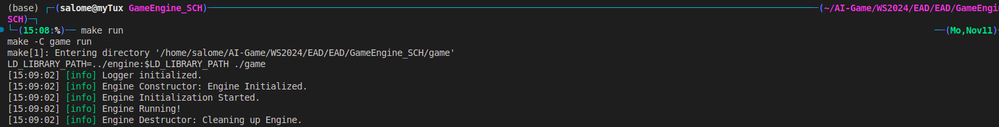

## How to build
### from Root (GameEngine_SCH)
    - make (to build both engine and game)
    - make run (to run the game)
    - make clean (optionally)

## Output (0V0) after Engine Setup


## Output (0V1) after adding a Logging System



## Basic Folder Structure
```plaintext
├── GameEngine_SCH
│   ├── engine
│   │   ├── libEngine.so
│   │   ├── Makefile
│   │   ├── private_include
│   │   └── src
│   │       └── Engine.cpp
│   │       └── Logger.cpp
│   ├── game
│   │   ├── game
│   │   ├── Makefile
│   │   ├── private_include
│   │   └── src
│   │       ├── main.cpp
│   ├── include
│   │   └── Engine.h
│   │   └── Logger.h
│   ├── Makefile
│   ├── README.md
|   ├── assets

## Author's notes:
- successfully tested on a Linux environment - no functionality guaranteed for other platforms at this point


